# Project_template

Это шаблон для решения проектной работы. Структура этого файла повторяет структуру заданий. Заполняйте его по мере работы над решением.

# Задание 1. Анализ и планирование

<aside>

Чтобы составить документ с описанием текущей архитектуры приложения, можно часть информации взять из описания компании и условия задания. Это нормально.

</aside>

## 1. Описание функциональности монолитного приложения

### Компоненты приложения Умный дом

Монолитное приложение Умный дом состоит из следующих компонентов:

* **MainApp** - исполняемый файл для запуска приложения.
* **SensorHandler**  - компонент, реализующий сервисы для получения запросов на управление датчиками от пользователя.
* **TemperatureService** - компонет, реализующий сервисы для взаимодействия с датчиками температуры.
* **Database** - компонент, реализующий получение информации из базы данных о зарегистрированных сервисов.
* **SensorModels** - компонент, описывающий модель данных приложения Умный дом.

Визуализацию текущей структуры исходного кода приложения Умный дом можно посмотреть на диаграме Smart home component diagram as-is:

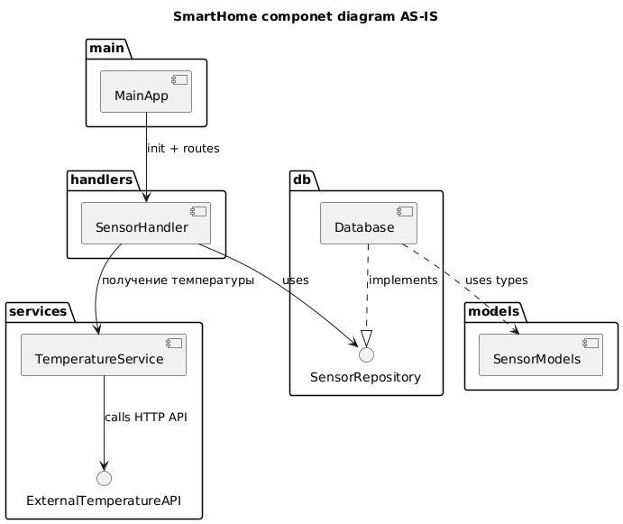

Далее подробнее рассмотрим устройство каждого компонента.

#### MainApp
Исполнительный файл `main.go`. При запуске: 

* **DB**: устанавливает связь с БД по адресу из переменной окруженя: *DATABASE_URL*.
* **TemperatureService**: подготавливает к работе сервисы для взаимодействия с датчиками температуры используя переменную окруженя: *TEMPERATURE_API_URL*.
* **SensorHandler**: подготавливает к работе сервисы для получения запросов на управления датчиками.
* **Server**: запускает сервер для работы приложения.

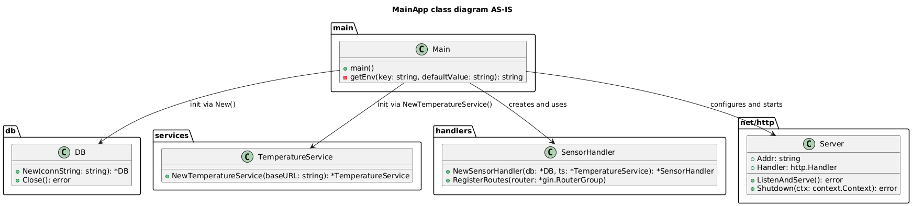

#### SensorHandler

Компонент из файла `./handlers/sensors.go` реализует входящие сервисы для запросов на управление датчиками:

* **GetSensors**  Реализует входящий сервис `GET /api/v1/sensors` для запроса списка зарегистрированных датчиков.
* **GetSensorByID**  Реализует входящий сервис `GET /api/v1/sensors/:id` для запроса информации по конкретному зарегистрированному датчику.
* **GetTemperatureByLocation**  Реализует входящий сервис `GET /api/v1/sensors/temperature/:location` для запроса текущей темперетуры зарегистрированного датчика отопления по названию места его установки.
* **CreateSensor**  Реалзует входящий сервис `POST /api/v1/sensors` для регистрации датчика.
* **UpdateSensor**  Реализет входящий сервис `PUT /api/v1/sensors/:id` для обновления зарегистрированного датчика.
* **DeleteSensor**  Реализует входящий сервис `DELETE /api/v1/sensors/:id` для удаления зарегистрированного датчика.
* **UpdateSensorValue**  Реализует входящий сервис `PATCH /api/v1/sensors/:id/value` для включения/выключения датчика и установки рабочего значения.

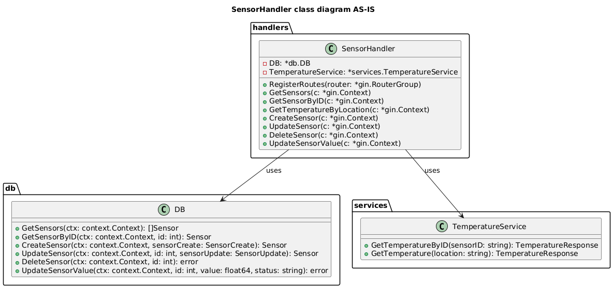


#### TemperatureService

Компонент из файла `./services/temperature_service.go` реализует сисходящие сервисы для взаимодействия с датчиками температуры:

* **GetTemperature** Реализует исходящий сервис `GET /temperature?location=:location` для запроса температуры датчика по месту установки.
* **GetTemperatureByID** Реализует исходящий сервис `GET /temperature/:id` для запроса температуры датчика по его id.

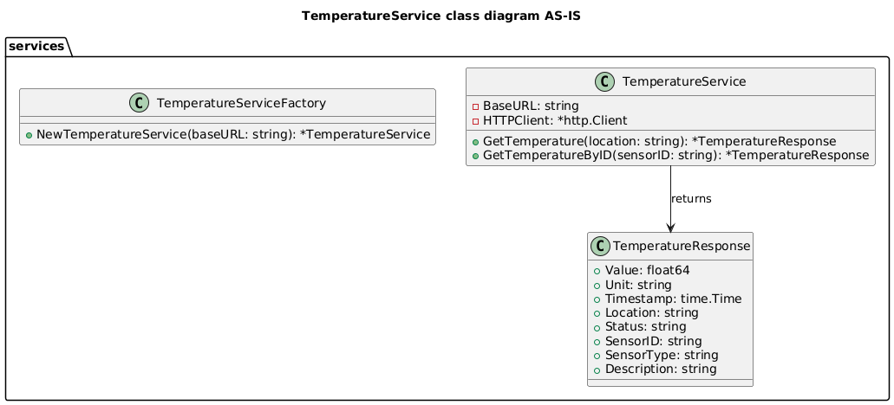

#### Database

Компонент из файла `./db/db.go` реализует функции получения информации из базы данных по заренистрированным датчикам:

* **GetSensors** - запрос в БД на получения списка всех заренистрированных датчиков.
* **GetSensorByID** - запрос в БД на получение информации по id конкретного датчика.
* **CreateSensor** - запрос в БД на регистрацию нового датчика.
* **UpdateSensor** - запрос в БД на обновление зарегистрированного датчика.
* **DeleteSensor** - запрос в БД на удаление зарегистрированного датчика.
* **UpdateSensorValue** - запрос в БД на включение/выключение датчика и установку его значения.

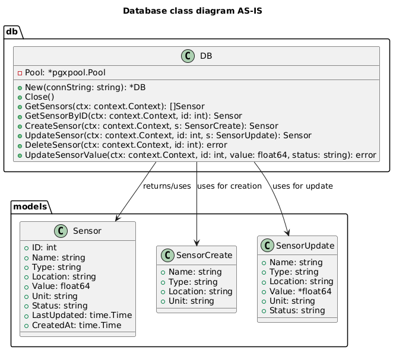

#### SensorModels

Компонент из файла ./models/sensor.go описывает модель данных:

* **Sensor** - общая модель датчиков.
* **SensorCreate** - модель для создания датчика.
* **SensorUpdate** - модель для обновления датчика.

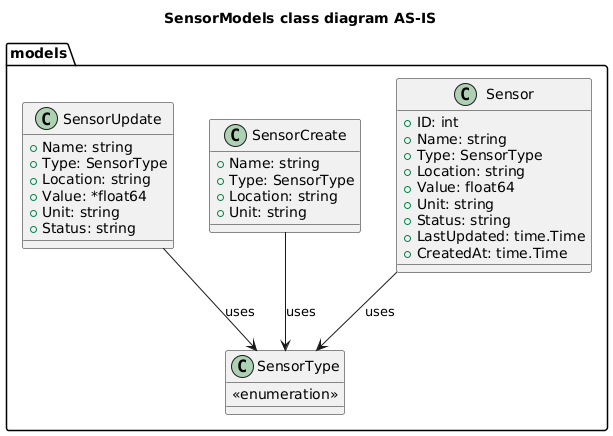

#### Дополнительные компоненты

##### init.sql

Cкрипт для создания БД smarthome. При запуске:

* Создает БД smarthome.
* Создает таблицу sensors для хранения информации по датчикам.
* Создает иднексы в таблице.

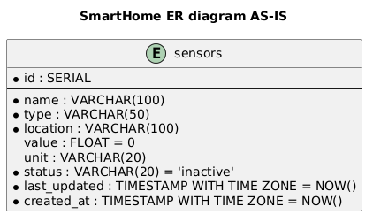

##### go.sum и go.mod
* **go.sum** - файл контроля целостности зависимостей.
* **go.mod** - файл декларации модуля.

##### Dockerfile

Файл создания Docker образа с приложением SmartHome:

* Рабочая директория `/app`.
* Директория приложения `/app/smarthome`.
* Порт `8080`.

### Функционал приложения Умный дом

1. **Управление устройствами**

Управление устройствами осуществляется через web-интерфейс специалистами компании Тёплый дом, пользователям этот функционал не доступен. Управление устройством предполагает:

   * Добавление датчиков отопления (POST /api/v1/sensors) 

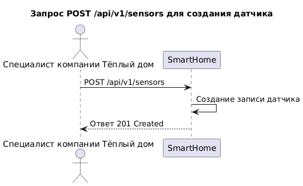

   * Обновление датчиков отопления (PUT /api/v1/sensors/:id)

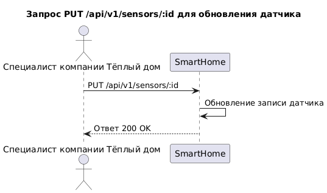

   * Удаление датчиков отопления (DELETE /api/v1/sensors/:id)

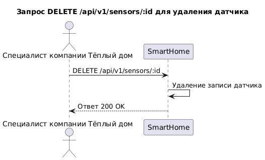

   * Просмотр информации по всем датчикам (GET /api/v1/sensors)

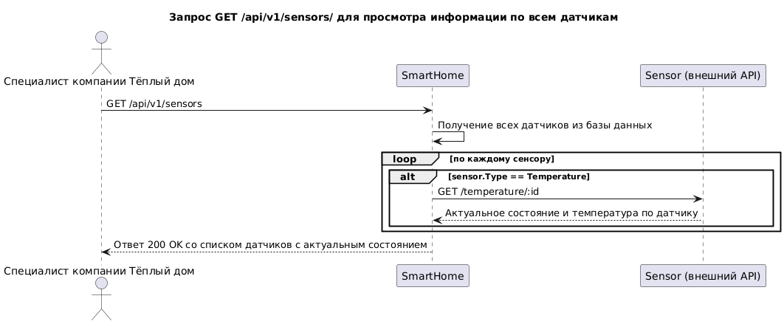

   * Просмотр информации конкретного датчика (GET /api/v1/sensors/:id)

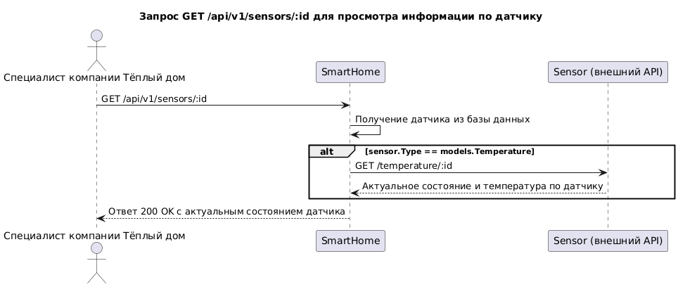


2. **Управление отоплением**

Пользователь может управлять отоплением исползьзуя web-интерфейс. Для пользователя доступно включение/выключение датчика и установка необходимой температуры.

   * Включение/выключение датчика и изменение температуры (PATCH /api/v1/sensors/:id/value)

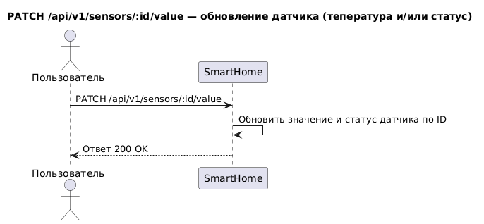

3. **Мониторинг температуры**

Пользователь может отслеживать температуру помещения используя web-интерфейс. Для просмотра информации по датчику необходимо знать его местоположение.

   * Просмотр информации конкретного датчика по местоположению (GET /api/v1/sensors/:location)

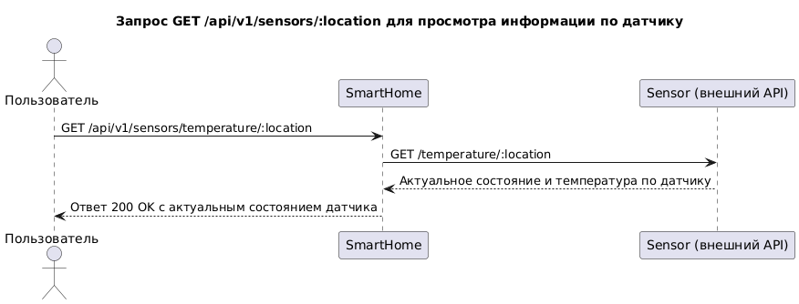


### 2. Анализ архитектуры монолитного приложения

* **Язык программирования**: Go
* **База данных**: PostgreSQL
* **Архитектура**: Монолитная, все компоненты системы (обработка запросов, бизнес-логика, работа с данными) находятся в рамках одного приложения.
* **Взаимодействие**: Синхронное, запросы обрабатываются последовательно.
* **Масштабируемость**: Ограничена, так как монолит сложно масштабировать по частям.
* **Развертывание**: Требует остановки всего приложения.

### 3. Определение доменов и границы контекстов

На текущий момент основной деятельностью компании является организация удаленного управления отопление в доме, соответственно в можно определить следующие домены и контексты:

* **Домен: управление отоплением**
  * контекст: управление датчиками
  * контекст: регулирование температуры
  * контекст: мониторинг температуры	

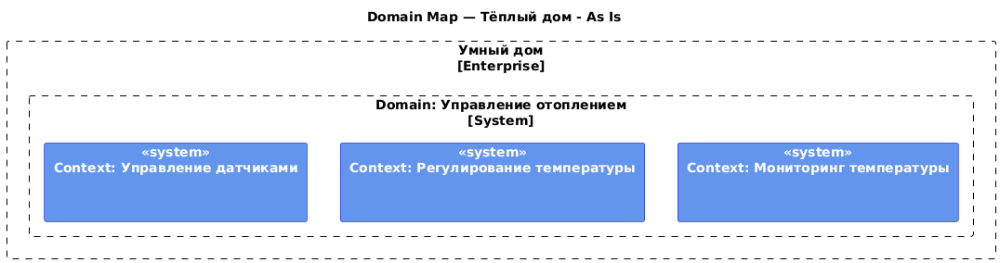

После стратегического проектирования целевой экосистемы, которая должна включать в себя возможность самообслуживания в режиме SaaS, управление отоплением, освещением, воротами, видеонаблюдением, сбор телеметрии можно выделить следующие домены, поддомены и контексты:

* **Домен: Удалённое управление**
  * *Поддомен: Управление устройствами*  
	** Контекст: Управление датчиками — добавление, удаление, обновление устройств  
    ** Контекст: Регулирование состояния — включение, выключение, установка температуры, яркости и т.п.  
    ** Контекст: Мониторинг состояния — просмотр текущей температуры, состояния света, ворот и т.п.
  * *Поддомен: Управление сценариями*  
    ** Контекст: Создание сценариев — конфигурация последовательностей действий по условиям  
    ** Контекст: Исполнение сценариев — запуск, триггеры, выполнение сценариев
  * *Поддомен: Управление телеметрией*  
    ** Контекст: Хранение и агрегация — запись, буферизация и агрегация данных с устройств  
    ** Контекст: Визуализация и уведомления — построение графиков, оповещения, правила уведомлений
  * *Контекст: Интеграция с устройствами*
* **Домен: Управление подписками**
  * *Поддомен: Управление пользователями*  
    ** Контекст: Управление аккаунтами — регистрация, авторизация, роли, профили
  * *Поддомен: Обработка платежей*  
    ** Контекст: Управление платежами — подписки, тарифы, биллинг  
    ** Контекст: Журнал транзакций — история оплат, статусы, возвраты

В рамках MVP проекта будет реализовываться Поддомен: *Управление устройсвами*, а также Контекст: *Интеграция с устройствами*.

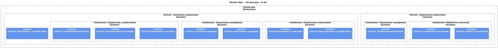

### **4. Проблемы монолитного решения**

Можно выделить следующие проблемы текущего монолитного решения:

- Сложность масштабирования: невозможно масштабировать отдельные части системы независимо.
- Трудности с развертыванием: любое изменение требует повторного деплоя всего приложения.
- Высокая связанность: изменение одного компонента может повлиять на другие.
- Устройства получают команды только по запросу сервера.
- Нет изоляции логических компонентов.
- Все модули используют одни и те же технологии.
- Сложность параллельной разработки и командного масштабирования.
- Сложно подключать устройства сторонних производителей.
- Ограничена гибкость в использовании различных протоколов и API.
- Подключение системы требует физического присутствия специалиста.
- Пользователь не может настроить или установить систему самостоятельно.

### 5. Визуализация контекста системы — диаграмма С4

Диаграмма контекста в модели C4 компании Тёплый дом представлена ниже.

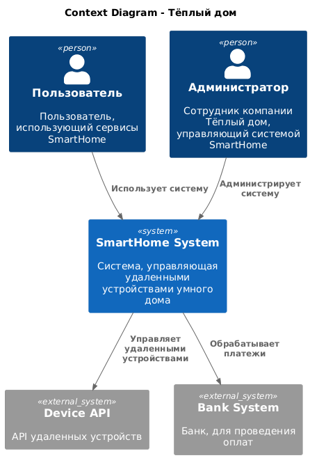

# Задание 2. Проектирование микросервисной архитектуры

В этом задании вам нужно предоставить только диаграммы в модели C4. Мы не просим вас отдельно описывать получившиеся микросервисы и то, как вы определили взаимодействия между компонентами To-Be системы. Если вы правильно подготовите диаграммы C4, они и так это покажут.

## **Диаграмма контейнеров (Containers)**

Диаграмма контейнеров в модели C4 компаии Тёплый дом строится на основе следующих требований:

1. Возможность самообслуживания в режиме SaaS
2. Управление отоплением
3. Управление освещением
4. Управление воротами
5. Управление видеонаблюдением
6. Возможность подключения других датчиков
7. Возможность самостоятельного подключения устройств
8. Возможность настройки сценариев
9. Возможность просмотра телеметрии

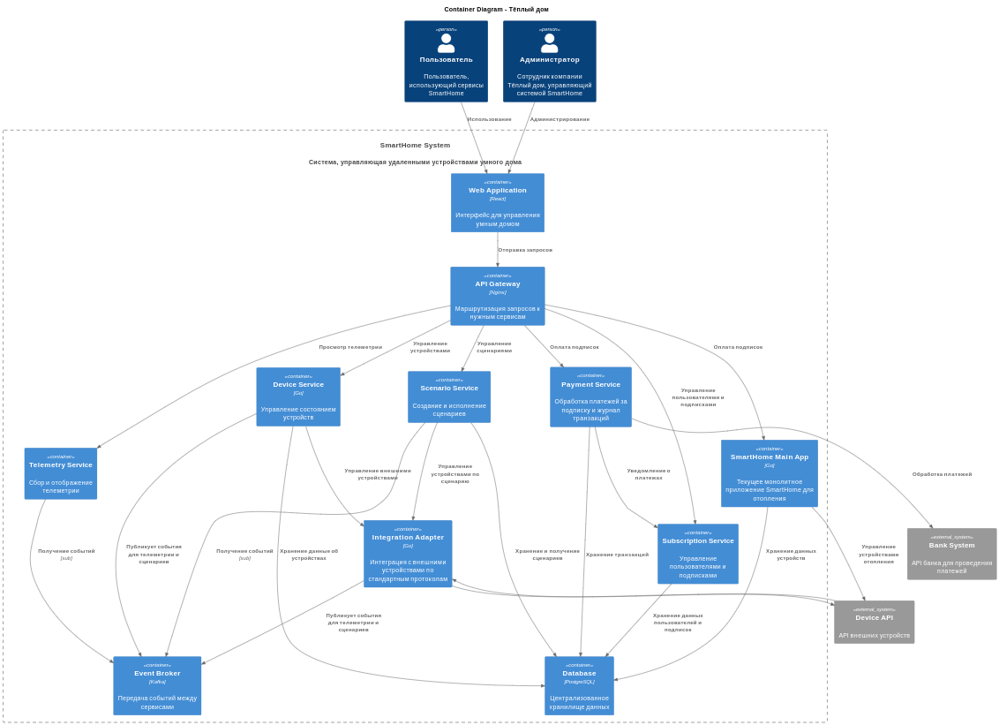

Для MVP проекта достаточно реализации контейнеров, указанных ниже:

* API Gateway
* Device Service
* Integration Adapter
* Database

В следующих разделах будет описание именно этих контейнеров. Контейнеры и функционал, который не входит в MVP описываться не будет.

## **Диаграмма компонентов (Components)**
### Компонент Web Application
Ниже представлена MVP диаграмма компонента WEb Application.

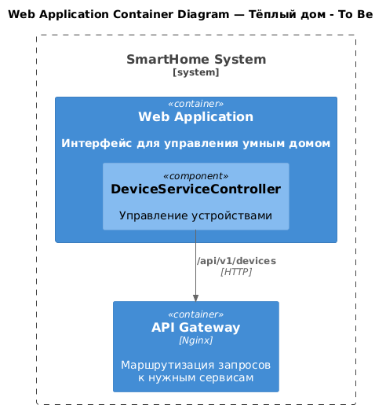

### Компонент API Gateway
Ниже представлена MVP диаграмма компонента API Gateway.

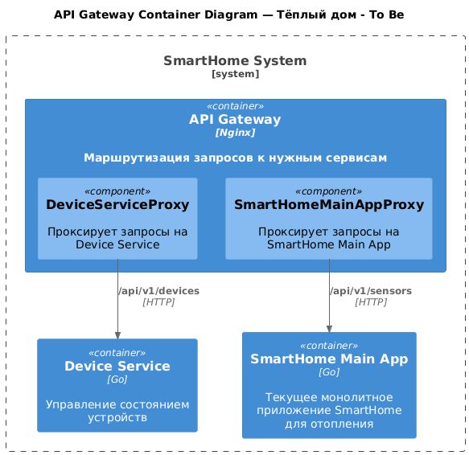

### Компонент Device Service
Ниже представлена MVP диаграмма компонента Device Service.

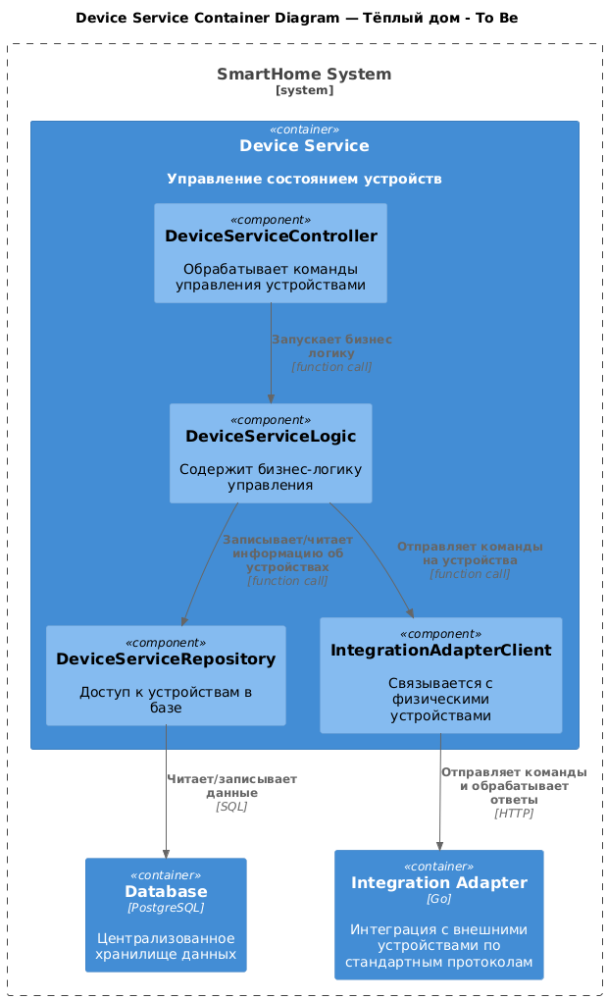

### Компонент Integration Adapter

Ниже представлена MVP диаграмма компонента Integration Adapter.

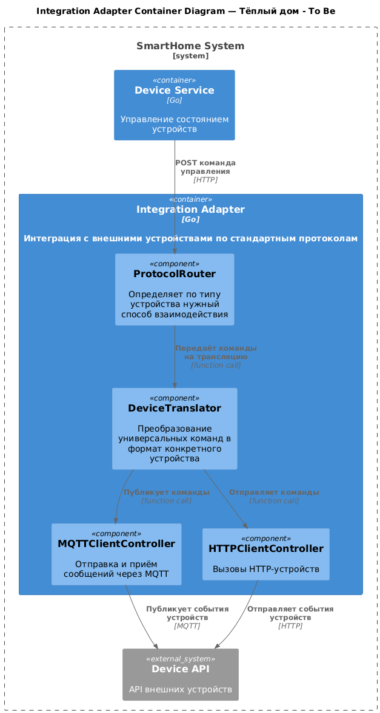

**Диаграмма кода (Code)**

Ниже представлена MVP диаграмма кода компонента Device Service.

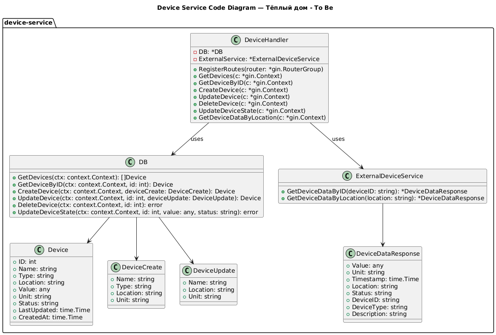

# Задание 3. Разработка ER-диаграммы

Ниже представлена MVP ER-диаграмма микросервиса, который основан на компоненте Device Service. 

1. devices - сновная сущность с устройствами (на базе sensors)
2. device_measurements - сущность для хранения параметров устройств (по аналогии с value, но с заделом, что параметров может быть больше и они разные).


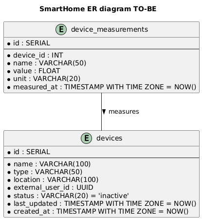

API Gateway, Integration Adapter не имеют под собой бизнес-сущностей, поэтому для описание не производится.

# Задание 4. Создание и документирование API

### 1. Тип API

Если рассматривать MVP вариант, то взаимодействие между Web Application -> API Gateway -> Device Services -> Integration Adapter будет через HTTP используя синхронные REST запросы. Можно выделить следующие плюсы:

1. Пользователь видит результат действия команды немедленно (исключается потеря ассинхронных ответов).
2. Простата трассировки и отладки.
3. Низкая задержка в обработке.
4. Простота перехода от монолитного приложения к микросервисам.
 
Взаимодействие между Integration Adapter и внешними устройствами будет зависеть от типа устройства. Это может быть как HTTP (по аналогии с датчиками отопления), так и напирмер MQTT.

Рассматривая целевую схему с микросервисами, можно выделить взаимодействие через брокер-сообщений для Scenario Service и Telemetry Service, так как им важно отслеживать события устройств для запуска сценариев и сбора телеметрии.

### 2. Документация API
Ниже представлена документация для двух микросервисов Device Services и Integration Adapter:

* [DeviceService.yaml](./apps/smart_home/DeviceService.yaml)
* [IntegrationAdapter.yaml](./apps/smart_home/IntegrationAdapter.yaml)

# Задание 5. Работа с docker и docker-compose

1. В рамках данного задания было сделано приложение temperature-api, написанное на pyhton. Для приложения был добавлен свой Dockerfile и requirements.
2. После этого был изменен файл docker-compose.yaml:
   1. В блок с контейнером postgres добавлены переменные окружения, сеть, автоматическия запуск файла init.sql, healthcheck, переименован том postgres-data в postgres-data-smarthome (были конфликты с предыдущими уроками)
   2. Добавлен блок с контейнером temperature-api с портом 8081 и соответствующей сетью
   3. В блок с app добавлена сеть, добавлены переменные окружения
3. Дополнительно изменил `temperature_service.go`, чтобы он корректно вызвал location с пробелом.
4. Добавил workflow для github с автоматической генерацией png диаграмм puml.

При запуске контейнеров через docker-compose.yaml (`docker-compose up --build`) может быть небольшая задержка с запуском smarthome-app из-за ожидания поднятия smarthome-postgres (ожидание может быть до одной минуты).

Проверять можно используя Postman коллекцию [smarthome-api.postman_collection.json](./apps/smarthome-api.postman_collection.json)

## Проверка работоспособности методов
### Health Check
```curl 
curl --location 'http://localhost:8080/health'
```

```json
{"status":"ok"}
```
### Create Sensor
```curl 
curl --location 'http://localhost:8080/api/v1/sensors' \
--header 'Content-Type: application/json' \
--data '{
    "name": "Living Room Temperature",
    "type": "temperature",
    "location": "Living Room",
    "unit": "°C"
}'
```

```json
{"id":1,"name":"Living Room Temperature","type":"temperature","location":"Living Room","value":0,"unit":"°C","status":"inactive","last_updated":"2025-06-18T18:21:14.624846Z","created_at":"2025-06-18T18:21:14.624846Z"}
```

### Update Sensor
```curl 
curl --location --request PUT 'http://localhost:8080/api/v1/sensors/1' \
--header 'Content-Type: application/json' \
--data '{
    "name": "Updated Living Room Temperature",
    "type": "temperature",
    "location": "Living Room",
    "unit": "°C"
}'
```

```json
{"id":1,"name":"Updated Living Room Temperature","type":"temperature","location":"Living Room","value":22.5,"unit":"°C","status":"active","last_updated":"2025-06-18T18:24:44.583761Z","created_at":"2025-06-18T18:21:14.624846Z"}
```
### Update Sensor Value
```curl 
curl --location --request PATCH 'http://localhost:8080/api/v1/sensors/1/value' \
--header 'Content-Type: application/json' \
--data '{
    "value": 22.5,
    "status": "active"
}'
```

```json
{"message":"Sensor value updated successfully"}
```
### Get All Sensors
```curl 
curl --location 'http://localhost:8080/api/v1/sensors'
```

```json
[{"id":1,"name":"Updated Living Room Temperature","type":"temperature","location":"Living Room","value":18.7,"unit":"°C","status":"active","last_updated":"2025-06-18T18:25:15.148633Z","created_at":"2025-06-18T18:21:14.624846Z"}]
```
### Get Sensor by ID
```curl 
curl --location 'http://localhost:8080/api/v1/sensors/1'
```

```json
{"id":1,"name":"Updated Living Room Temperature","type":"temperature","location":"Living Room","value":23.49,"unit":"°C","status":"active","last_updated":"2025-06-18T18:25:49.691911Z","created_at":"2025-06-18T18:21:14.624846Z"}
```
### Get Sensor by Location
```curl 
curl --location 'http://localhost:8080/api/v1/sensors/temperature/Living%20Room'
```

```json
{"description":"Temperature sensor reading by location","location":"Living Room","status":"active","timestamp":"2025-06-18T19:05:39.567114Z","unit":"C","value":21.9}
```
### Delete Sensor
```curl 
curl --location --request DELETE 'http://localhost:8080/api/v1/sensors/1'
```

```json
{"message":"Sensor deleted successfully"}
```